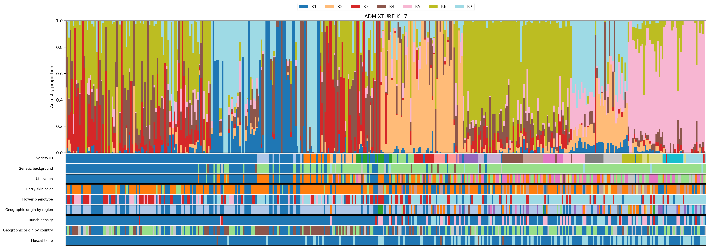

# Nextflow Pipelines for NGS Data Analysis

[](https://www.nextflow.io/)
[](https://www.python.org/)
[](LICENSE)

Four NGS analyses, each written as a re-runnable pipeline rather than a
notebook: population genomics, WES variant calling, scRNA-seq integration, and
bulk RNA-seq differential expression. Eight Nextflow DSL2 workflows in total,
with Python doing the analysis and plotting.

| Directory | Analysis | Stack |
| --- | --- | --- |
| [`grapewines_project/`](grapewines_project/) | Population genomics of Caucasian grapevine — 412 samples, ~815k SNPs | PLINK, ADMIXTURE, vcftools, SNPhylo, Nextflow |
| [`tmf_project/`](tmf_project/) | WES variant calling for two exomes, through to an annotated gene report | BWA, GATK, ANNOVAR, Nextflow |
| [`single_cell_pipeline/`](single_cell_pipeline/) | scRNA-seq: QC → doublet removal → Harmony integration | scanpy, harmonypy, Nextflow |
| [`enrichment_project/`](enrichment_project/) | Bulk RNA-seq: DESeq2 differential expression → ORA + GSEA | pydeseq2, gseapy |

Each directory has its own README with the stage-by-stage breakdown, inputs,
and how to run it.

---

## Population genomics — the largest of the four

Structure and differentiation of Caucasian grapevine (*Vitis vinifera*):
412 samples, ~815k biallelic SNPs after filtering, 19 chromosomes.

```
00_preprocess   VCF -> filtered VCF -> PLINK bed/bim/fam
      |
01_admixture    ADMIXTURE K=2..10 -> CV curve -> barplots
      |
02_pca          PLINK PCA, an independent check on the same structure
      |
03_fst          assign samples to K groups -> pairwise FST -> heatmap
      |         (03b re-runs all 21 comparisons at equal n)
04_manhattan_annotation
                per-SNP FST -> 50 kb windows -> top 1% -> genes
05_tree         ML phylogeny (SNPhylo); 05b is an NJ sensitivity check
```



*ADMIXTURE at K = 7, samples ordered by ancestry component, with the metadata
columns aligned underneath.*

**One result worth reading in full:** the 21 pairwise FST values correlate with
group size at Spearman −0.79, which looks exactly like a small-sample artefact.
Re-running every comparison with the group sizes held equal
([`03b_fst_equal_n/`](grapewines_project/pipelines/03b_fst_equal_n/)) showed the
suspicion was **wrong** — the correlation barely moved (−0.756), and the ranking
reproduced across ten independent draws (Kendall τ = +0.95). What the numbers
actually track is within-group diversity: pooled diversity H<sub>t</sub> is
constant across all 21 pairs to within 1.3%, so FST here measures how internally
uniform two groups are, not how far apart they sit.
[Full write-up](grapewines_project/pipelines/03b_fst_equal_n/README.md).

## Repository layout

```
grapewines_project/
  conf/base.config          shared executor, reports, common params
  pipelines/                00_preprocess .. 05b_nj_tree, one dir per stage
    <stage>/main.nf         workflow
    <stage>/bin/            scripts placed on PATH for that workflow
    <stage>/nextflow.config stage-specific params
  reference/                small inputs that belong in git
  results/                  published outputs (small ones are versioned)

tmf_project/
  scr/                      standalone BWA/FastQC/MultiQC steps
  variant_calling/main.nf   SORT -> MARKDUP -> HAPLOTYPECALLER -> ... -> report

single_cell_pipeline/
  main.nf                   QC -> DOUBLETS -> MERGE -> NORMALIZE -> HARMONY
  scripts/                  one Python script per stage

enrichment_project/
  deseq2_analysis.py        pydeseq2 DE, volcano + shrinkage figures
  enrichment_analysis.py    ORA + GSEA + PCA
```

Each pipeline is launched from its own directory so that `projectDir` resolves
and `bin/` lands on `PATH`:

```bash
cd grapewines_project/pipelines/03_fst
nextflow run . -profile slurm --k 7
```

## What is in git and what is not

Git holds **code, configs and small text results** — nothing a pipeline can
regenerate. Kept: `*.nf`, `*.config`, scripts, `.fam`, `.Q` matrices, summary
tables, final figures.

Not versioned (see [`.gitignore`](.gitignore)): `work/`, `.nextflow/`, cluster
logs, virtualenvs, and all bulk genomics data — FASTQ, BAM, VCF, PLINK
`.bed`/`.bim`, ADMIXTURE `.P`, per-SNP `.weir.fst`, `.h5ad`.

Absolute paths in the configs are placeholders (`/path/to/...`). The pipelines
were run on a SLURM cluster; override `--project_root` and the data paths, or
drop `executor = 'slurm'` from the relevant `nextflow.config` to run locally.

## Provenance

The grapevine analysis began as a group project with a shared dataset and a
mentor's brief; the pipeline code, the R-to-Python ports, and the equal-*n* FST
follow-up here are mine. The other three are single-author.

## License

MIT — see [LICENSE](LICENSE).
